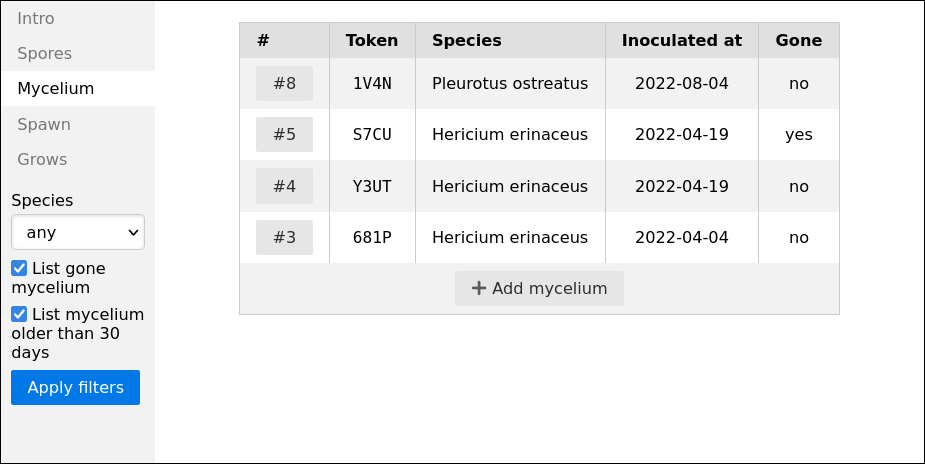
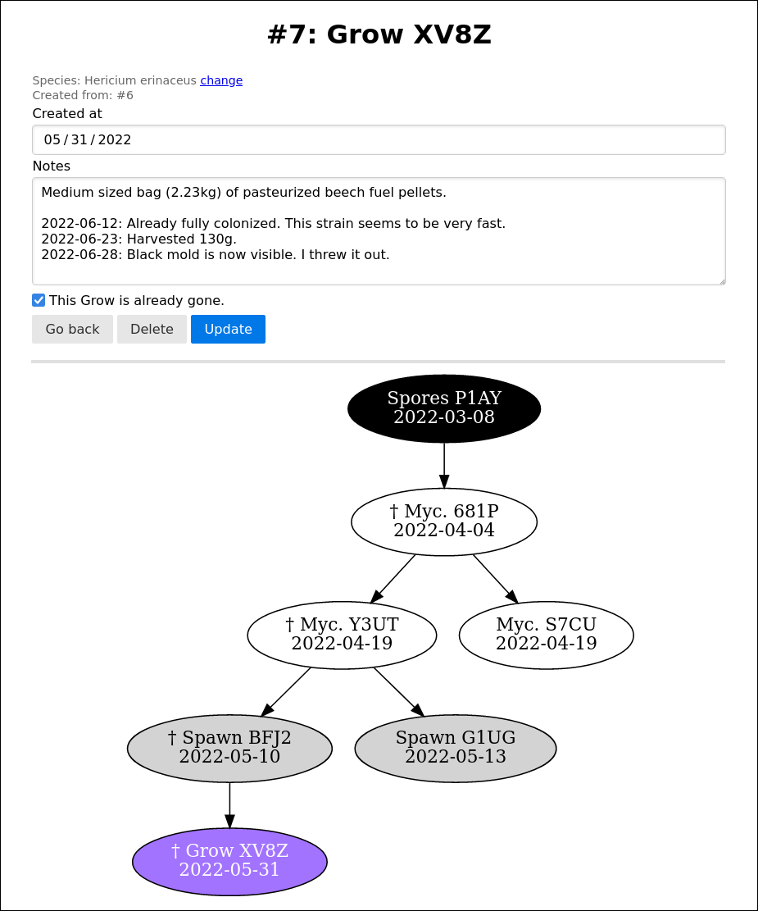

mycolog helps you keep an overview of your mushroom cultivation
projects. It can store notes for each component, so that it's easier to
remember which experiments succeeded and which failed. Genetics can be
traced through family trees.

# Installation
You can download the precompiled program from the
[releases page](https://github.com/codesoap/mycolog/releases).

In order to get family trees displayed, you need to have Graphviz
installed. You can download it [here](https://graphviz.org/download/).

If you want to compile the program yourself, do this:

```bash
git clone git@github.com:codesoap/mycolog.git
cd mycolog
go install ./cmd/mycolog/
# The binary is now at ~/go/bin/mycolog.
```

# Backups
mycolog stores all its data in a single file. On Windows
you'll find it in your user profile folder, usually
`C:\Users\<your-username>\mycolog.sqlite3`.

On Linux and other unix-like operating systems, you'll find it at
`XDG_DATA_HOME`, if this environment variable is set. Otherwise it will
be located at `~/.local/share/mycolog.sqlite3`.
